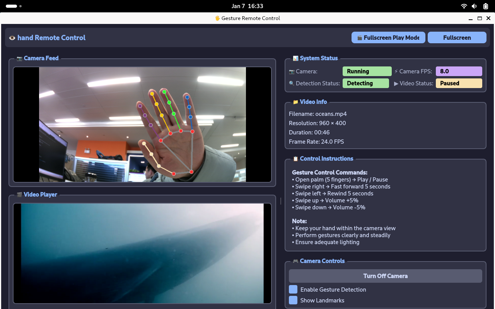
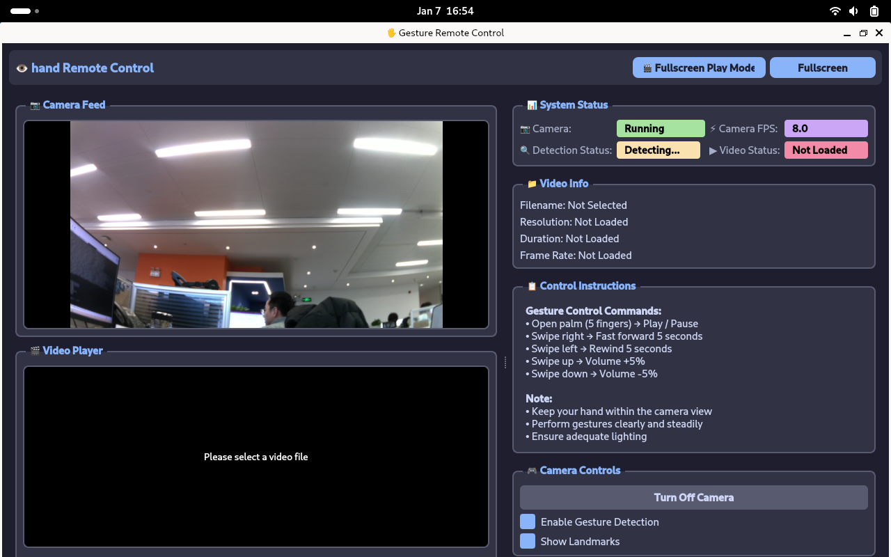

# Gesture-Controlled

[中文](README.md) | English

This project is a gesture-recognition–based remote video control demo implemented on the Quectel Pi H1 single-board computer.
The system captures hand images through a camera and applies AI-based hand gesture recognition algorithms to enable touchless control of video playback, progress, and volume, providing a natural and intuitive user interaction experience.



## Features

- Real-time hand detection and tracking
- Support for multiple intuitive control gestures
- Remote video playback control
   - Play / Pause
   - Fast Forward / Rewind
   - Volume adjustment
- Hand status visualization (Hand detected / No hand detected)
- Single-hand natural operation with a low learning curve
- Fully local processing: low latency and no cloud dependency

**Supported Gesture Mapping**

> Please ensure that the camera is facing the user’s operation area and that the lighting conditions are stable.

|Gesture Action|Control Function|
|----------|---------|
|Open palm (5 fingers)|Play / Pause|
|Swipe right|Fast forward 5 seconds|
|Swipe leftRewind 5 seconds|
|Swipe up|Volume +5%|
|Swipe down|Volume −5%|

## Hardware Requirements

- Quectel Pi H1 single-board computer
- USB camera
- Display device (DSI touchscreen)
- Audio output device (speaker or headphones)

## Software Environment Setup

> Verify whether multiple Python versions exist on the system to avoid import issues after package installation.

- Operating System: Debian 13 (default OS for Quectel Pi H1)
- Video playback: ffmpeg 
- Python：Python 3  
- Dependencies:
   - Python 3.9-3.12
   - OpenCV-Python == 4.8.1.78
   - MediaPipe == 0.10.9
   - NumPy == 1.24.3
   - PySide6 == 6.5.3
   - protobuf == 3.20.3

```shell
# Update package sources and install ffmpeg
sudo apt update && sudo apt install -y ffmpeg
# Upgrade pip
pip install --upgrade pip
# Install Python dependencies
pip install -r requirements.txt
# Run the application
python3 main.py
```

## Project Structure

```
gesture-remote-control/
├── assets/                     # Static resource files
├── src/                        # Source code directory
│   ├── gesture_recognizer.py   # Gesture recognition core logic
│   ├── video_capture.py        # Video capture thread
│   ├── video_player.py         # Video player thread
│   ├── fullscreen_player_mode.py # Fullscreen playback UI
│   ├── log.py                  # Logging module
├── log_files/                  # Log files
├── main.py                     # Main program entry point
├── README.md                   # Project documentation
└── requirements.txt            # Dependency list
```

## Running the Application

```shell
# run
python3 main.py
```


## Reporting Issues
Issues and Pull Requests are welcome to help improve this project.
